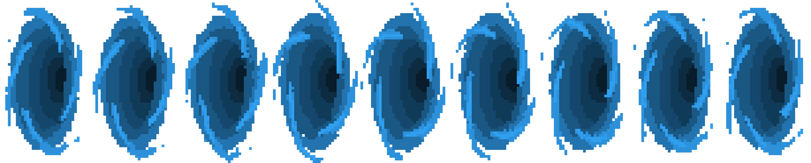
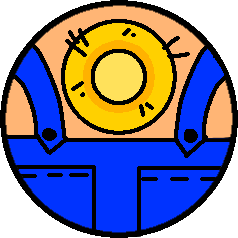
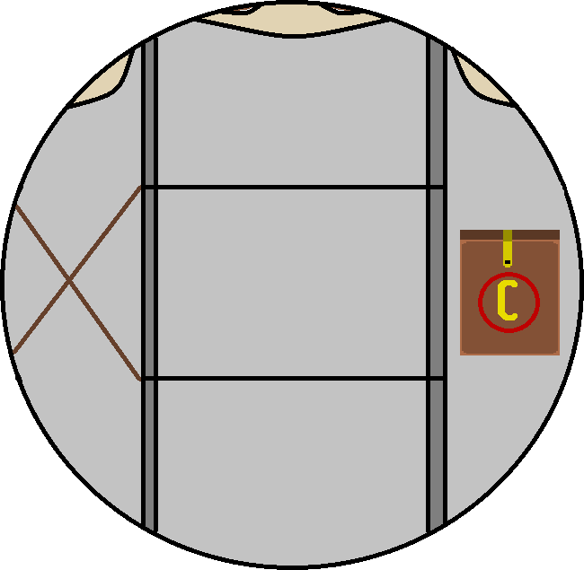

# multigame

We are the "Boys At Github" team. We create our own game in C++ using the SFML library.

We developing our own engine specifically for this game, but part of engine can be used for other projects

You can suggest various features in VK messages: https://vk.com/majong562

At the moment the game is not playable. We are at the development stage of the engine. In the future, game mechanics and a plot that are already being written will be added. The game is conceived in the roguelike style. Our team has artists, so all the sprites for the game will be their own.

# currently available mechanics:
- walk
  - w a s d
  - Shift (sprint)
- shoot
  - LMB
- weapons (is selected using the corresponding button on the keyboard)
  - 1: Pistol
  - 2: Shotgun
  - 3: Revolver
  - 4: Rifle
  - 5: Bubblegun
- Interactible objects (interaction with the X button)
  - portal (step on it and push X)
- minimap (use Tab for fullscreen minimap, move and zoom it)
- Enemies
  - DistortedScientist

# Our sprites and arts
- **[Textures](https://github.com/George562/multigame/blob/main/sources/textures)**
- **[Portal](https://github.com/George562/multigame/blob/main/sources/textures/Portal.png)**
- **[Player](https://github.com/George562/multigame/blob/main/sources/textures/Player.png)**
- **[Farmer](https://github.com/George562/multigame/blob/main/sources/textures/Farmer.png)**
- **[DistortedScientist](https://github.com/George562/multigame/blob/main/sources/textures/DistortedScientist.png)**

	
  
  
  

# Our music
- **[Main menu music](https://github.com/George562/multigame/blob/main/sources/music/RestAreaMusic.wav)**

# Attention

The game may not run on your computer due to the lack of some libraries (.dll). If this happens, then report us about problem and we try to solve it.

If you want to recompile the game, then use the Makefile.
